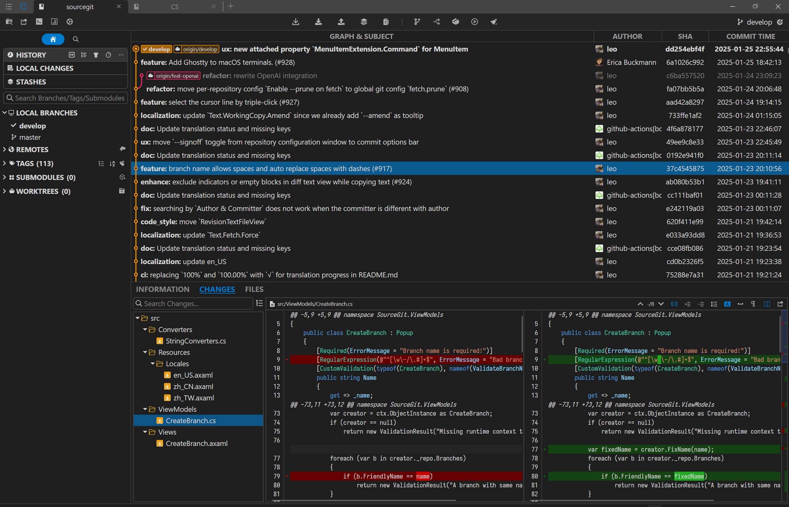
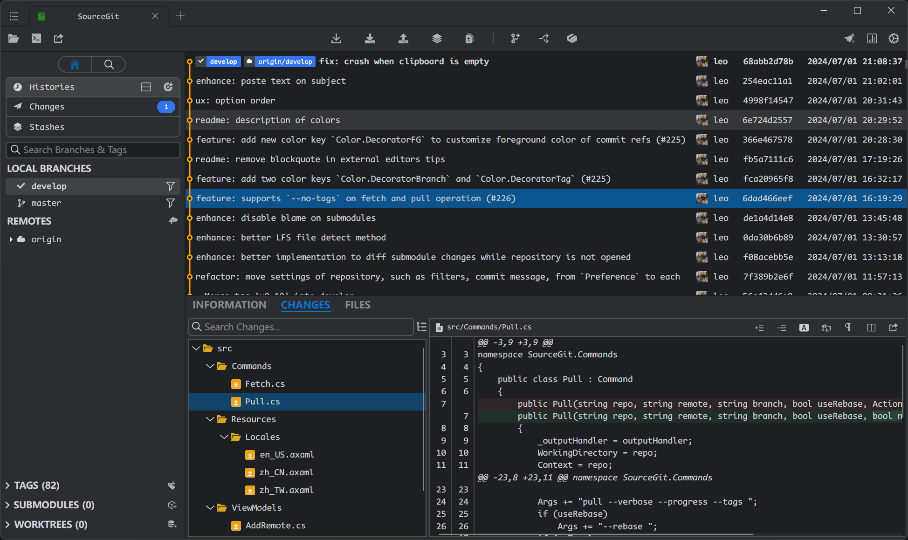
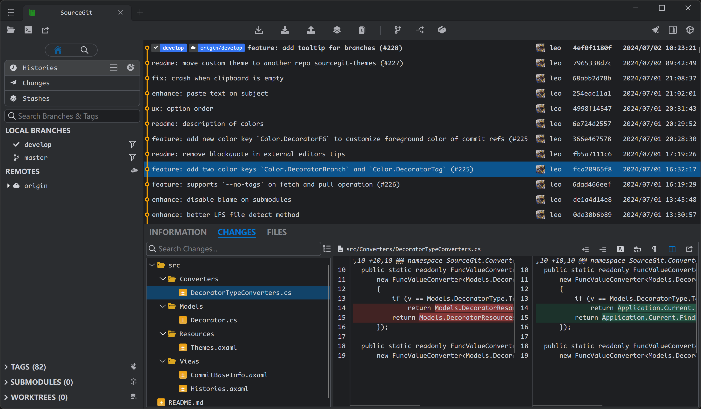
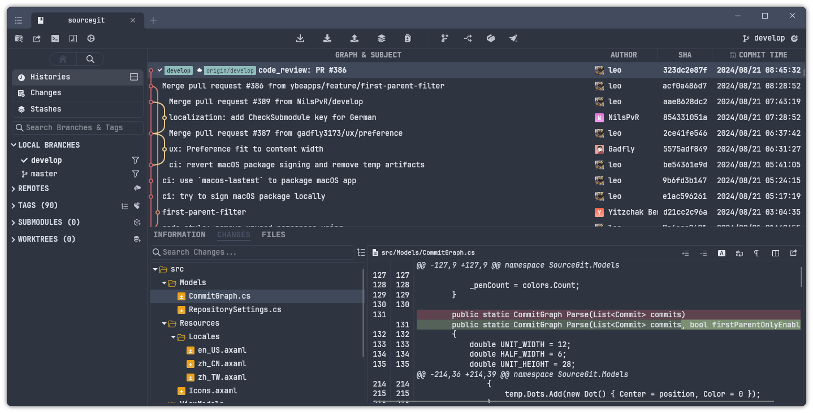
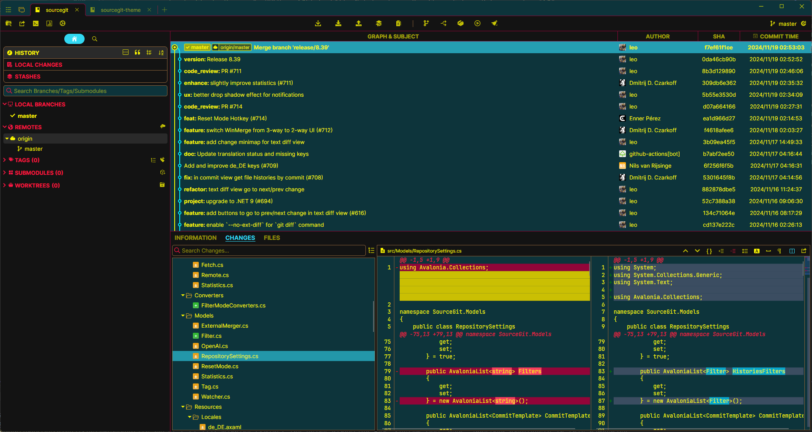
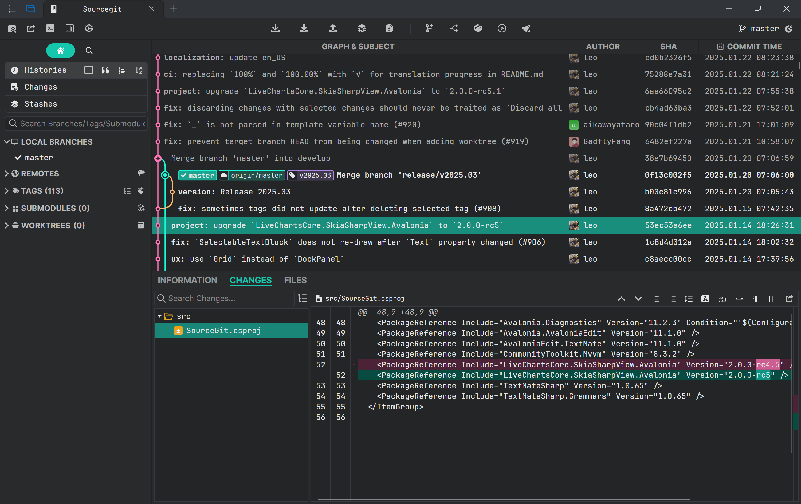
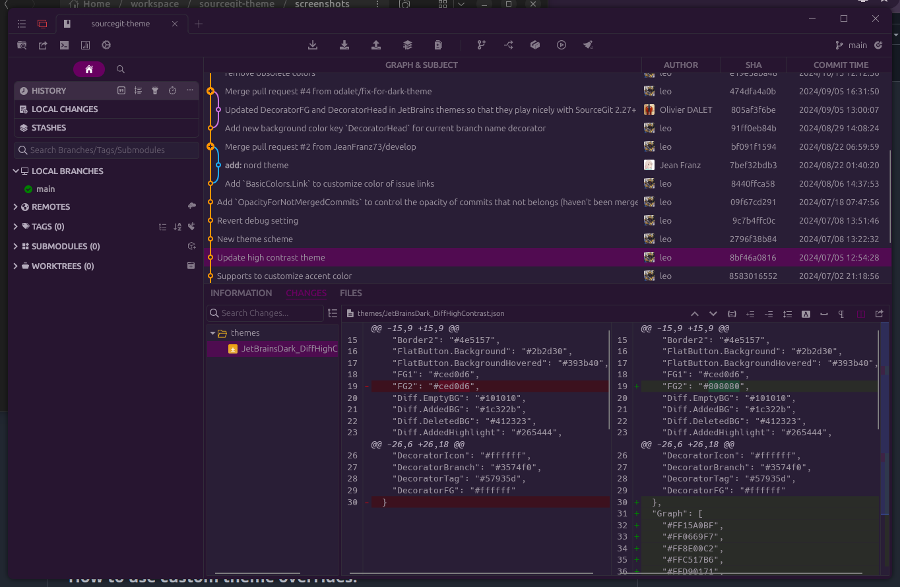
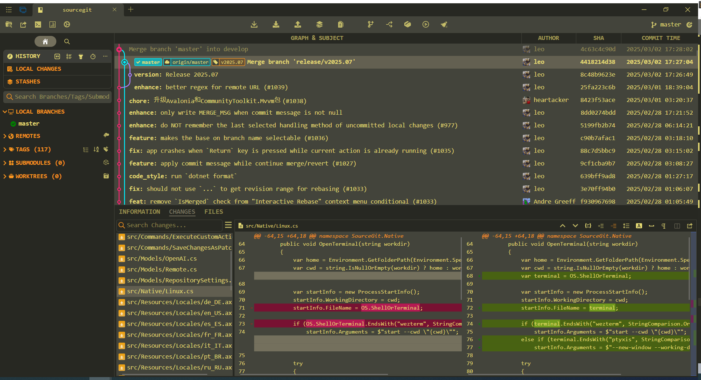
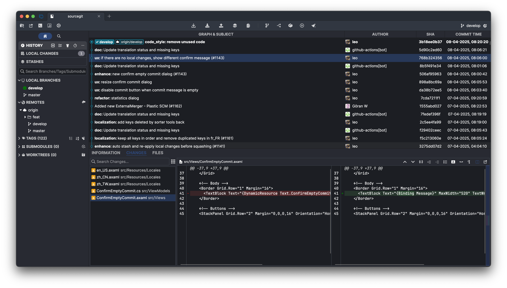
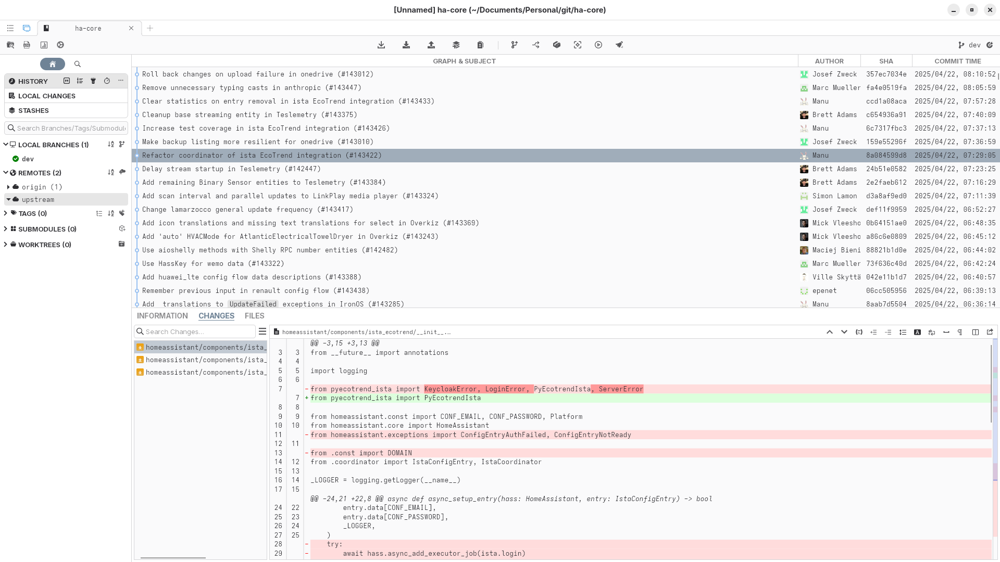

# sourcegit-theme

Custom Themes for SourceGit

## How to use custom theme overrides.

Open `Preference` -> `Appearance`, choose the json file you just created in `Theme Overrides`.

## Screenshots

[ForkDark](./themes/ForkDark.json) from [@carun](https://github.com/carun)

[JetBrainsDark](./themes/JetBrainsDark.json) from [@MelonHell](https://gist.github.com/MelonHell)

[JetBrainsDark DiffHighContrast](./themes/JetBrainsDark_DiffHighContrast.json) based on `JetBrainsDark` with higher contrast in diff view.

[Nord](./themes/Nord.json) from [@JeanFranz73](https://gist.github.com/JeanFranz73) based on [Nord palette](https://github.com/nordtheme/nord).

[Cyberpunk 2077](./themes/Cyberpunk2077.json) from [@berkanuslu](https://github.com/berkanuslu) based on [Cyberpunk 2077 UI Presentation](https://www.artstation.com/artwork/18mLB8).

[Panda theme](./themes/Panda.json) from [@WTFive](https://github.com/wtfive) based on [VSCode Panda theme](https://marketplace.visualstudio.com/items?itemName=tinkertrain.theme-panda).

[SynthWave '84 theme](./themes/Synthwave84.json) based on [VSCode SynthWave '84 theme](https://marketplace.visualstudio.com/items?itemName=RobbOwen.synthwave-vscode).

[Monokai theme](./themes/Monokai.json) from [@RyanKneeya](https://github.com/RyanKneeya) based on [Sublime Text Monokai](https://github.com/gerardroche/sublime-monokai-free).

[Squid](./themes/Squid.json) from [@ilianoKokoro](https://github.com/ilianoKokoro) based on the `GitKraken` color scheme.

[AdwaitaLight](./themes/AdwaitaLight.json) from [@W-Floyd](https://github.com/W-Floyd) based on the `Adwaita` color scheme.

